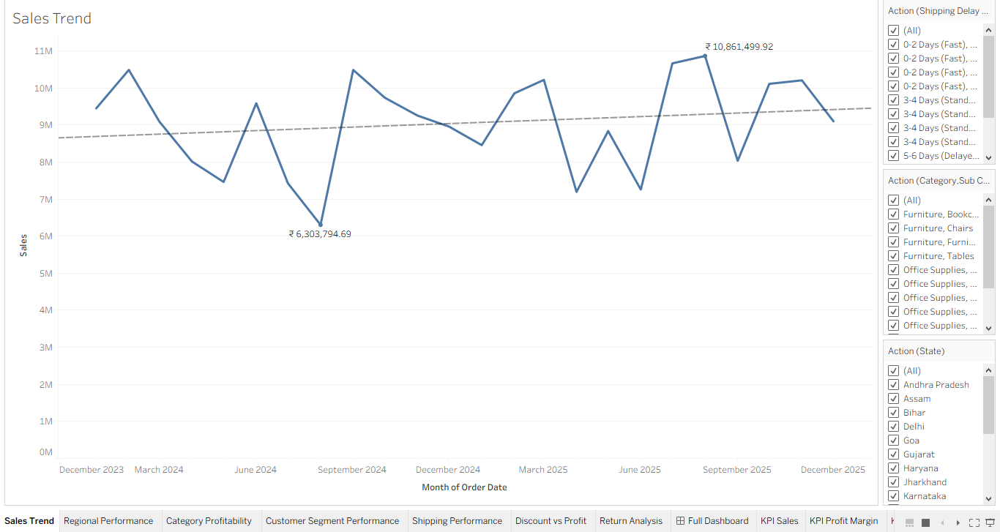
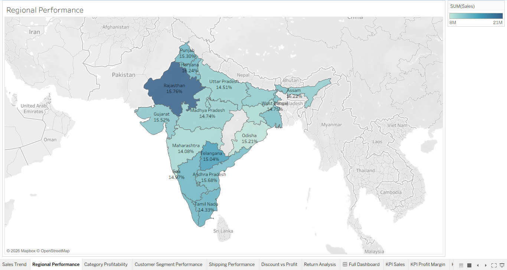
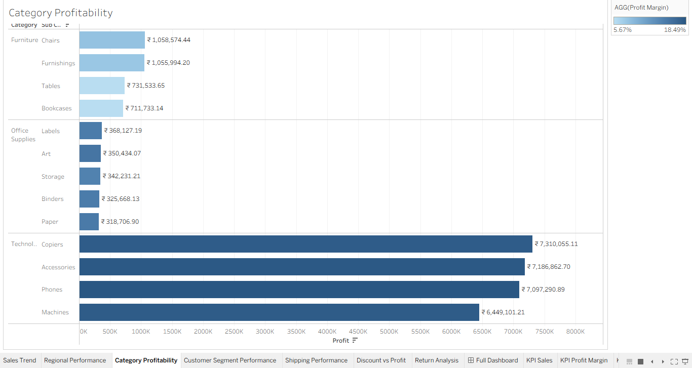
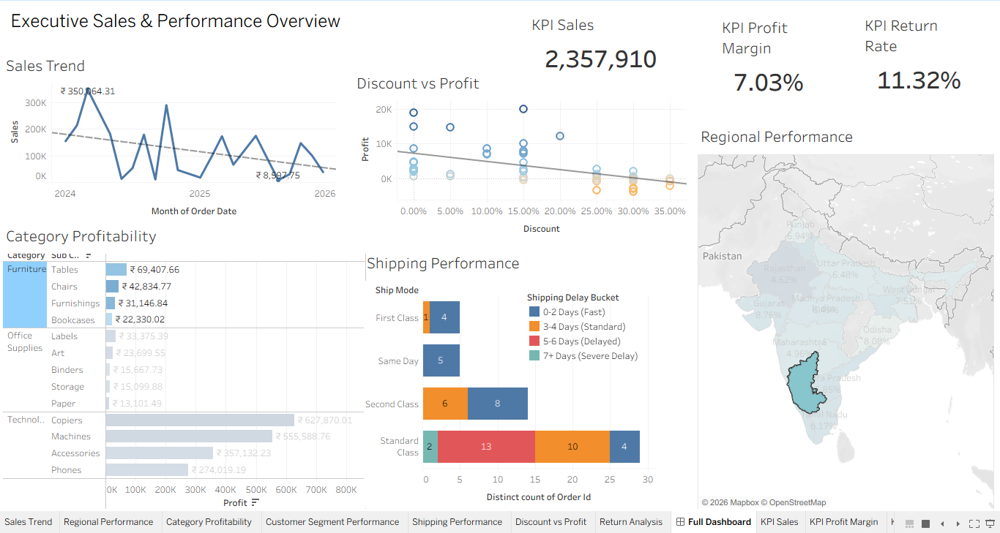
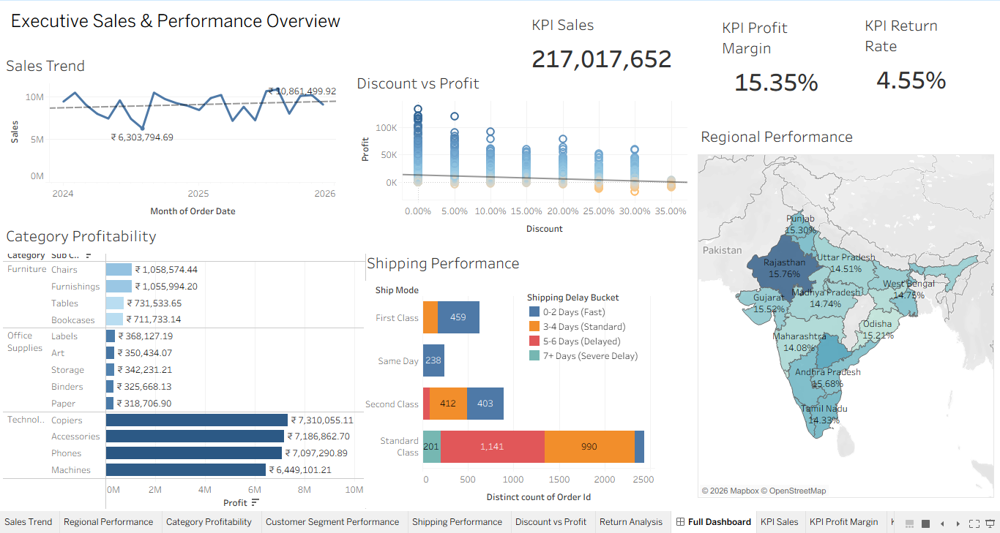

# Part 4: Tableau Executive Dashboard & Data Storytelling

### Business Problem Summary
To build a dashboard using Tableau to monitor sales performance, profitability, customer segments, category performance, shipping performance, discount impact, and return patterns. And help the leadership identify business opportunities and risks.
________
### Dataset Description
- **Order Date and Ship Date:** to track seasonal trends, growth, and timelines.

- **Country, State, and Region:** are Geographical Markers used to show localized performance and mapping.

- **Customer ID, Name, and Segment** are Customer Demographics. Segment contains "Consumer", "Corporate", "Home Office" fields.

- **Product ID, Category:** show Product Hierarchy. Categories contain "Technology", "Furniture", "Office Supplies", and Sub-Categories.

- **Sales** (gross revenue), **Quantity** (volume), **Discount** (promotional deduction percentage), and **Profit** (net baseline return) are Financial Metrics.

- **Ship Mode** contains "Same Day", "First Class", "Second Class", "Standard Class".
_________
### Tableau Workbook Description
The Tableau workbook contains 7 sheets (Sales Trend, Regional Performance, Category Profitability, Customer Segment Performance, Shipping Performance, Discount vs Profits, Return Analysis), showing charts of different metrics. One Dashboard showing 5 of 7 graphs. 3 of the 5 charts in the dashboard contain filters (by region, by category and sub-category, Ship mode or shipping delay buckets.)
__________
### Calculated Fields Created

| Metric Created | Tableau Formula | What It Does |
| :---: | :---: | :---: |
| **Profit Margin** | ``` SUM([profit]) / SUM([sales]) ``` | Measures corporate profitability efficiency. |  
| **Cost:** | ``` [sales] - [profit] ``` | Calculates the operational cost base per line item. |  
| **Average Order Value (AOV):** | ``` SUM([sales]) / COUNTD([order_id]) ``` | Tracks average transaction size based on unique orders (`COUNTD`) |
| **Return Rate:** | ``` SUM([return_flag]) / COUNT([order_id]) ``` | Measures the proportion of transactions resulting in a return. |
| **Shipping Delay Bucket:** | ` IF [delivery_days] <= 2 THEN "0-2 Days (Fast)"` <br> `ELSEIF [delivery_days] <= 4 THEN "3-4 Days (Standard)"` <br> `ELSEIF [delivery_days] <= 6 THEN "5-6 Days (Delayed)"` <br> `ELSE "7+ Days (Severe Delay)"` <br> `END ` | Segments `delivery_days` into tiers to visually segregate logistically strained orders. |

________
### Dashboard Components
1. **Sales Trend (Line Chart):** Maps total sales chronologically from January 2024 to December 2025 to track business health monthly.



2. **Regional Performance (Choropleth Map):** Geographically shows gross sales volume by state, that also shows profit margins, upon hovering over the states, by states.



3. **Category Profitability (Horizontal Bar Chart):** Shows financial profits by Category and Sub-Category, color-coded by profit margins.



4. **Shipping Performance (Stacked Horizontal Bar Chart):** Shows order volumes across Ship Modes, further divided by shipping delay buckets.

5. **Discount vs Profits (Scatter Plot):** Plots individual orders across discount and profit coordinates, also showing a trend line for overall results.
________
### Filters and Interactions Used
- You can hover over any charts to display sales (in Rs.), profits (in Rs.), profit margins (%), discounts (%), states, categories, sub-categories etc.

- You can click on any state on the map, ship modes, categories and sub-categories and see charts change based on the filters.


_______
### Key Business Insights
- The company sales turned around from all time low in August 2024 (Rs. 6.30M) to the revenue peak in August 2025 (Rs. 10.86M).

- Rajasthan dominates sales at Rs. 20.83M, while states like Jharkhand and Karnataka lead with peak profit margins of 16.83% and 16.60% respectively.

- Technology products represent the financial backbone of the company (around 18% profit margins; up to Rs. 7.31M of profit per sub-category), keeping the company profitable while cross-subsidizing the low-performing Furniture line (5.67% - 5.71% profit margins).

- Standard Class shipping represents a severe supply chain failure, generating over 93% of all delayed shipments nationwide. Further, First Class and Same day tiers frequently violate the delivery windows, with 165 First Class orders arriving late.

- Scatter plot analysis shows that a strict discount boundary at 20% is necessary to prevent more losses. Any discounts exceeding 20% drops maximum profit potential.
_________
### Dashboard Story Summary
The analysis shows that the organization has successfully scaled market but faces major operational issues. The majority of the profits are supported entirely by the high performing Technology division and strong consumer sales in the South. However, these profits are actively leaking out of the business due to high Furniture product returns (peaking at 8.42% for Bookcases), many shipping delays, and high sales discounts. The company must strategise by stopping high discounts, auditing furniture category, and improving courier contracts.


_________
### Assumptions and Limitations
- The dataset records gross profits but lacks further insight into independent operational variables, such as exact regional warehousing or real-time cost fluctuations.

- Shipping delay analysis does not account for localized external disruptions like weather conditions, holidays, etc that could potentially skew delay data.

- While the database tracks high product return rates in categories like Furniture, it does not show the customer reasons and additional information about the products being returns.
_________